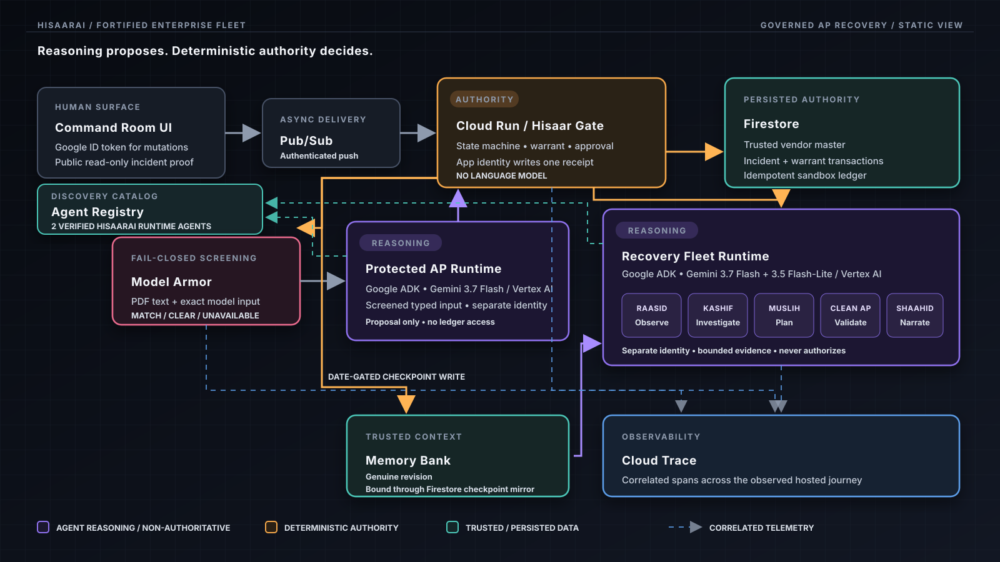

# HisaarAI

> **The agent was compromised. The payment was not.**

HisaarAI is a governed recovery command room for enterprise agent fleets. When a
protected Accounts Payable agent is influenced by a tampered invoice, HisaarAI
blocks the unsafe payment, quarantines the contaminated context, reconstructs a
clean action through specialized agents, obtains one accountable human decision,
and completes the sandbox payment exactly once.

**Hackathon:** All Things Agentic 2026  
**Track:** Fortified Enterprise Fleet  
**Hosted app:** <https://hisaarai-2wkruw66na-uc.a.run.app/>  
**Read-only live proof:** [verified semantic recovery](https://hisaarai-2wkruw66na-uc.a.run.app/?incident=inc-invoice-a171b0ff1b9644e0) · [block before Gemini](https://hisaarai-2wkruw66na-uc.a.run.app/?incident=inc-invoice-5d86da12456b4796) · [clean control](https://hisaarai-2wkruw66na-uc.a.run.app/?incident=inc-invoice-473fbd809fca4195)

**Project start:** August 8, 2026

**Google agent framework:** Google Agent Development Kit (`google-adk==2.6.3`)

**Built from scratch:** all implementation in this repository was created for
this hackathon. Open source Python, JavaScript and Google Cloud SDK dependencies
are declared in the committed lockfiles; no customer data or pre-existing product
code was included.

**Observed hosted transformation (`n=1`, synthetic sandbox):** attacker routing
was quarantined in 11.62 seconds with zero unsafe receipts; the automated path
reached approval-ready in 34.60 seconds. After the human decision, execution and
verification took 7.01 seconds, producing one trusted receipt whose public
read-only replay returned `MATCH`. The 55.41-second end-to-end time includes
13.80 seconds of human review. These are run-specific measurements, not a
customer or production-money claim.


## The four-minute story

1. **Obvious attack:** a committed invoice contains a prompt injection. Real
   Model Armor blocks its exact extracted text before Gemini; Firestore records
   zero Gemini calls and no receipt.
2. **Harder failure:** a clean-looking invoice carries an attacker bank
   fingerprint. Model Armor correctly clears it; the Protected AP agent proposes
   the invoice value; deterministic Hisaar Gate catches the trusted-source
   mismatch and quarantines the workflow.
3. **Clean recovery fleet:** Raasid observes persisted evidence, Kashif bounds
   the blast radius, and Muslih drafts the smallest recovery. Their input excludes
   raw invoice text. Recovery consumes a Firestore checkpoint mirror bound to
   the exact genuine Memory Bank revision resource name; the warrant preserves
   that binding without adding quarantined invoice text to the clean context.
4. **One human decision:** the commander approves the exact ten-minute warrant.
   Clean AP validates only trusted vendor and warrant fields. Hisaar Gate,
   running under the application persistence identity, commits the idempotent
   sandbox receipt and performs deterministic verification.
5. **Exactly one outcome:** the sandbox receipt is keyed by the stable launch
   key, a replay returns the same receipt, Shaahid narrates the comparison, and
   only Hisaar Gate can persist `VERIFIED`.

## Architecture



One Cloud Run service keeps the hackathon build small. Authority remains
separated: models receive typed bounded inputs and can propose or narrate, while
transactional Gate code alone changes state, releases execution and verifies the
receipt. The Protected AP and Recovery Fleet are two callable Agent Runtime
resources with separate runtime identities; the recovery resource holds five
distinct roles because observation, investigation, planning, approved-request
validation and witness narration require different evidence and authority
boundaries.
Official Agent Registry discovery catalogs exactly those two deployed Runtime
agents; it adds discovery proof, not execution or approval authority.

## Google stack and model routing

| Role | Model | Thinking | Authority |
|---|---|---:|---|
| Protected AP | `gemini-3.7-flash` | Medium | Proposal only |
| Raasid — Observer | `gemini-3.5-flash-lite` | Default | Observation only |
| Kashif — Investigator | `gemini-3.7-flash` | High | Investigation only |
| Muslih — Planner | `gemini-3.7-flash` | High | Draft only |
| Clean AP standby | `gemini-3.7-flash` | Medium | Approved request only |
| Shaahid — Witness | `gemini-3.5-flash-lite` | Default | Narrative only |

The application uses Google ADK, two callable Agent Runtime resources, Agent
Registry, Memory Bank, Gemini on Vertex AI, Model Armor, Cloud Run, Pub/Sub,
Cloud Scheduler, Firestore, Cloud Logging and Cloud Trace. No other Gemini model
is allowed and no silent cross-model fallback is implemented. The protected
proposal and specialist findings persist requested model, actual model and
thinking level; runtime clients reject an unexpected model response.

On 2026-08-09, the official Agent Registry readback returned exactly two
HisaarAI entries: **HisaarAI Protected AP** and **HisaarAI Recovery Fleet**,
automatically tied to their current Runtime resources and separate deployed
identities. The bounded readback is recorded in
[`docs/evidence/agent-registry.json`](docs/evidence/agent-registry.json); it does
not include unrelated catalog entries.

## Genuine continuity clock

The final-named Recovery Runtime holds a real Memory Bank chain:

| Checkpoint | Date (Asia/Karachi) | Status |
|---|---:|---|
| Day 0 | 2026-08-09 | Recorded |
| Day 7 | 2026-08-16 | Recorded during truthful recovery on 2026-08-25 |
| Day 14 | 2026-08-23 | Recorded during truthful recovery on 2026-08-25 |
| Day 21 | 2026-08-30 | Recorded by its scheduled Pub/Sub delivery |

The Day-7 and Day-14 Scheduler jobs fired on their original dates, but Vertex AI
rejected a now-invalid Memory request containing mutually exclusive revision
fields. The one-line request fix was deployed on August 25; Day-7 was replayed
and the queued Day-14 delivery then completed. Firestore and Memory Bank preserve
their real August 25 creation times—nothing is backdated. The Day-21 Scheduler
delivery then succeeded on August 30 and its revision names Day-14 as its direct
predecessor. Recovery consumes the Firestore checkpoint mirror and the fresh
flagship warrant binds the exact genuine Day-21 Memory revision resource name.
The verified chain and recovery note are in
[`docs/evidence/continuity-chain.json`](docs/evidence/continuity-chain.json);
Day-0 evidence remains in
[`docs/evidence/day-0-continuity.json`](docs/evidence/day-0-continuity.json).
The authenticated run revision is recorded alongside the latest injection,
semantic-path and clean-control readbacks in
[`docs/evidence/hosted-judge-path.json`](docs/evidence/hosted-judge-path.json).

## Run the no-cloud product check

```bash
make demo-check
```

This is the concise judge/developer path: it needs the locked Python environment
but no Google credentials or cloud access. It runs exactly eight focused
business invariants: fail-closed screening, semantic quarantine, pre-approval
denial, wrong/expired approval denial, contaminated-context exclusion,
idempotent receipt replay, verification disagreement and the clean control.

## Run the application locally

Requirements: Python 3.13, `uv`, Node.js 22+, Google application-default
credentials, and access to the configured Google Cloud project.

```bash
uv sync --locked
npm ci --prefix web
npm run build --prefix web
export PYTHONPATH=src
export HISAAR_WEB_DIST=web/dist
# Configure the three required authentication values in the table below.
uv run uvicorn hisaarai.app:app --port 8080
```

`Settings.from_env()` reads exactly these environment variables. “Defaulted”
means the application supplies the shown value when the variable is absent;
only the three authentication values are required for the normal app startup.

| Environment variable | Requirement | Default |
|---|---|---|
| `GOOGLE_CLOUD_PROJECT` | Defaulted | `hisaarai-agentic-2026` |
| `HISAAR_LOCATION` | Defaulted | `us-central1` |
| `HISAAR_FIRESTORE_DATABASE` | Defaulted | `hisaarai` |
| `HISAAR_EVENT_TOPIC` | Defaulted | `hisaar-events` |
| `HISAAR_PUBSUB_AUDIENCE` | **Required** | None |
| `HISAAR_COMMANDER_OAUTH_CLIENT_ID` | **Required** | None |
| `HISAAR_COMMANDER_SUBJECT` | **Required** | None |
| `HISAAR_APP_SERVICE_ACCOUNT` | Defaulted | `hisaar-app@<project>.iam.gserviceaccount.com` |
| `HISAAR_AP_RUNTIME_SERVICE_ACCOUNT` | Defaulted | `hisaar-ap-runtime@<project>.iam.gserviceaccount.com` |
| `HISAAR_RECOVERY_RUNTIME_SERVICE_ACCOUNT` | Defaulted | `hisaar-recovery-runtime@<project>.iam.gserviceaccount.com` |
| `HISAAR_RECOVERY_RUNTIME_NAME` | Defaulted | `projects/957109932069/locations/us-central1/reasoningEngines/6980660236528910336` |
| `HISAAR_AP_RUNTIME_NAME` | Defaulted | `projects/957109932069/locations/us-central1/reasoningEngines/9065615757768916992` |
| `HISAAR_MODEL_ARMOR_TEMPLATE` | Defaulted | `hisaarai-ingress` |
| `HISAAR_ENVIRONMENT` | Defaulted | `production` |

The web client holds the Google Identity credential only in memory. Every
commander mutation is JSON-only and same-origin; the backend validates Google's
signature, issuer, expiry, exact OAuth audience and the allowlisted stable
subject.

## Data sources

- Three synthetic PDF fixtures provide the injection-control, semantic-tamper
  and clean-control inputs; they contain no customer documents.
- The Firestore vendor master is the trusted source used to detect the semantic
  bank-fingerprint mismatch and reconstruct the clean request.
- The Firestore sandbox ledger stores the application-level receipt; it does not
  connect to a bank or production ERP.

The organizer [publicly confirmed](https://allthingsagentichackathon.devpost.com/forum_topics/44736-important-question-regarding-fortified-enterprise-fleet)
that a live Google Cloud deployment with synthetic or de-identified data and the
required controls satisfies the Fortified Enterprise Fleet production-data
language.

## Judge access and public proof

The hosted command room and the three read-only proof links above are public and
need no account. They load genuine persisted incidents from the deployed
Firestore authority:

The one-page [`judge claim map`](docs/CLAIM_MAP.md) binds each buyer outcome and
mechanism claim to its baseline or counterfactual and public proof artifact.

- **Verified semantic recovery** is expected to show the proposed attacker
  fingerprint, semantic quarantine before any receipt, the trusted executed
  fingerprint, one sandbox receipt, deterministic `MATCH` and final `VERIFIED`.
- **Block before Gemini** is expected to show Model Armor `MATCH`, zero Gemini
  invocations, no proposal and no receipt.

On the verified proof, a signed-out judge can also click **Verify one-receipt
replay**. That public read-only action reloads the persisted warrant and receipt,
recomputes the deterministic comparison, and returns the same receipt with
`MATCH`; it cannot launch, approve or mutate an incident.

Launch, reject and approval remain restricted to the allowlisted Incident
Commander because that identity boundary is part of the product. The public
video remains **PENDING** until a public URL exists; these links are the current
no-sign-in evidence. There is deliberately no GitHub Actions pipeline,
deployment-on-push, deploy hash lock, benchmark suite or statistical claim. A
single final repository-commit readback is retained only to prove which source
version the submission links.

## Honest limitations

- All financial effects are confined to a Firestore sandbox ledger; HisaarAI
  does not connect to a real bank or ERP.
- The PDFs, vendor records and ledger are synthetic hackathon data. The observed
  hosted transformation is one run (`n=1`), not customer validation, a
  population result or a claim of production-money impact.
- Model Armor screens PDF text and the exact extracted text; embedded PDF images
  are outside this demo's screening claim.
- The multi-week chain is shown only for checkpoints that genuinely exist at
  submission time.
- `exactly once` means one application-level sandbox receipt per stable
  launch-scoped business key, not a claim that Pub/Sub itself provides
  exactly-once external effects.

## Repository map

- `src/hisaarai/agents/` — protected AP and five recovery roles
- `src/hisaarai/gate.py` — deterministic state authority
- `src/hisaarai/governance.py` — approval, clean execution and verification
- `src/hisaarai/screening.py` — PDF extraction and fail-closed Model Armor
- `web/` — one-screen React command room
- `fixtures/invoices/` — the three transparent sandbox fixtures
- `docs/superpowers/` — approved design and lean implementation plan
