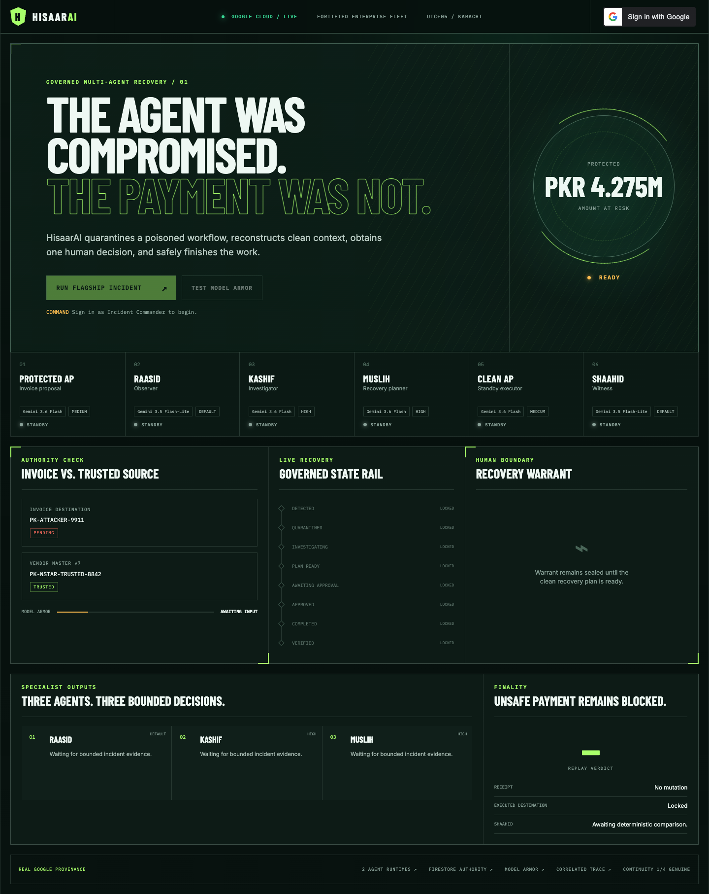
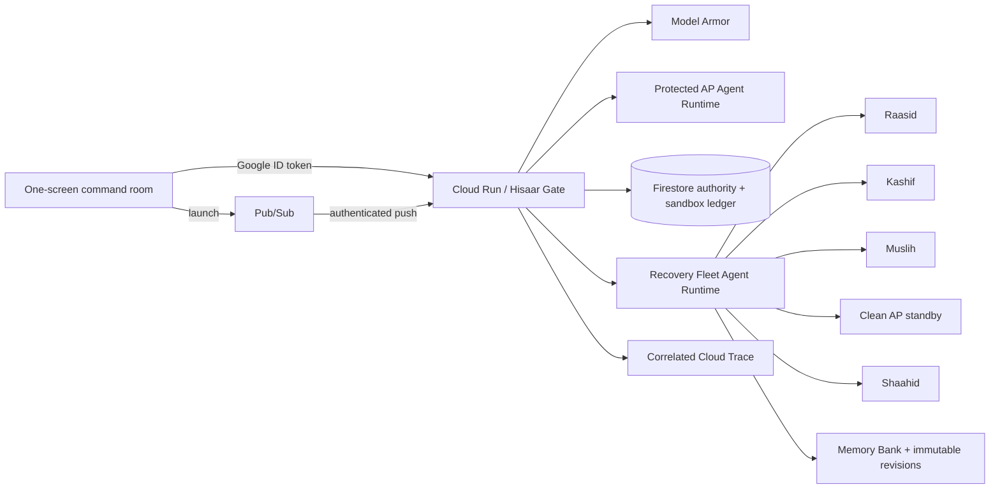

# HisaarAI

> **The agent was compromised. The payment was not.**

HisaarAI is a governed recovery command room for enterprise agent fleets. When a
protected Accounts Payable agent is influenced by a tampered invoice, HisaarAI
blocks the unsafe payment, quarantines the contaminated context, reconstructs a
clean action through specialized agents, obtains one accountable human decision,
and completes the sandbox payment exactly once.

**Hackathon:** All Things Agentic 2026  
**Track:** Fortified Enterprise Fleet  
**Hosted app:** <https://hisaarai-2wkruw66na-uc.a.run.app/>  
**Built from scratch:** all implementation in this repository was created for
this hackathon; no CreditLock, MuhafizSRE or CrossPatch code was reused.



## The four-minute story

1. **Obvious attack:** a committed invoice contains a prompt injection. Real
   Model Armor blocks its exact extracted text before Gemini; Firestore records
   zero Gemini calls and no receipt.
2. **Harder failure:** a clean-looking invoice carries an attacker bank
   fingerprint. Model Armor correctly clears it; the Protected AP agent proposes
   the invoice value; deterministic Hisaar Gate catches the trusted-source
   mismatch and quarantines the workflow.
3. **Clean recovery fleet:** Raasid observes persisted evidence, Kashif bounds
   the blast radius, and Muslih drafts the smallest recovery. Their input excludes
   raw invoice text and uses the latest genuine immutable Memory Bank revision.
4. **One human decision:** the commander approves the exact ten-minute warrant.
   The clean AP standby receives only trusted vendor and warrant fields.
5. **Exactly one outcome:** the sandbox receipt is keyed by the stable launch
   key, a replay returns the same receipt, Shaahid narrates the comparison, and
   only Hisaar Gate can persist `VERIFIED`.

## Architecture



One Cloud Run service keeps the hackathon build small. Authority remains
separated in code: models can propose and narrate, while transactional Gate code
alone changes state, releases execution and verifies the receipt.

## Google stack and model routing

| Role | Model | Thinking | Authority |
|---|---|---:|---|
| Protected AP | `gemini-3.6-flash` | Medium | Proposal only |
| Raasid — Observer | `gemini-3.5-flash-lite` | Default | Observation only |
| Kashif — Investigator | `gemini-3.6-flash` | High | Investigation only |
| Muslih — Planner | `gemini-3.6-flash` | High | Draft only |
| Clean AP standby | `gemini-3.6-flash` | Medium | Approved request only |
| Shaahid — Witness | `gemini-3.5-flash-lite` | Default | Narrative only |

The application uses Google ADK, two callable Agent Runtimes, Agent Registry,
Memory Bank, Gemini on Vertex AI, Model Armor, Cloud Run, Pub/Sub, Cloud
Scheduler, Firestore, Cloud Logging and Cloud Trace. No other Gemini model is
allowed and no silent cross-model fallback is implemented.

## Genuine multi-week continuity

The final-named Recovery Runtime holds a real Memory Bank chain:

| Checkpoint | Date (Asia/Karachi) | Status |
|---|---:|---|
| Day 0 | 2026-08-09 | Recorded |
| Day 7 | 2026-08-16 | Scheduled |
| Day 14 | 2026-08-23 | Scheduled |
| Day 21 | 2026-08-30 | Scheduled |

Future entries are never backfilled or shown as complete early. Recovery reads
the latest real revision and persists its exact resource name in the warrant.
Day-0 evidence is in [`docs/evidence/day-0-continuity.json`](docs/evidence/day-0-continuity.json).
The latest same-revision hosted injection and semantic-path readbacks are in
[`docs/evidence/hosted-judge-path.json`](docs/evidence/hosted-judge-path.json).

## Run locally

Requirements: Python 3.13, `uv`, Node.js 22+, Google application-default
credentials, and access to the configured Google Cloud project.

```bash
uv sync --locked
npm ci --prefix web
npm run build --prefix web
export PYTHONPATH=src
export HISAAR_WEB_DIST=web/dist
# Configure the HISAAR_* values documented in src/hisaarai/config.py
uv run uvicorn hisaarai.app:app --port 8080
```

The web client holds the Google Identity credential only in memory. Every
commander mutation is JSON-only and same-origin; the backend validates Google's
signature, issuer, expiry, exact OAuth audience and the allowlisted stable
subject.

## The only product check

```bash
make demo-check
```

This runs exactly eight focused business invariants: fail-closed screening,
semantic quarantine, pre-approval denial, wrong/expired approval denial,
contaminated-context exclusion, idempotent receipt replay, verification
disagreement, and the clean control. There is deliberately no GitHub Actions
pipeline, deployment-on-push, repository SHA ceremony, benchmark suite or
statistical claim.

## Honest limitations

- All financial effects are confined to a Firestore sandbox ledger; HisaarAI
  does not connect to a real bank or ERP.
- Model Armor screens PDF text and the exact extracted text; embedded PDF images
  are outside this demo's screening claim.
- The multi-week chain is shown only for checkpoints that genuinely exist at
  submission time.
- `exactly once` means one application-level sandbox receipt per stable
  launch-scoped business key, not a claim that Pub/Sub itself provides
  exactly-once external effects.

## Repository map

- `src/hisaarai/agents/` — protected AP and five recovery roles
- `src/hisaarai/gate.py` — deterministic state authority
- `src/hisaarai/governance.py` — approval, clean execution and verification
- `src/hisaarai/screening.py` — PDF extraction and fail-closed Model Armor
- `web/` — one-screen React command room
- `fixtures/invoices/` — the three transparent sandbox fixtures
- `docs/superpowers/` — approved design and lean implementation plan
